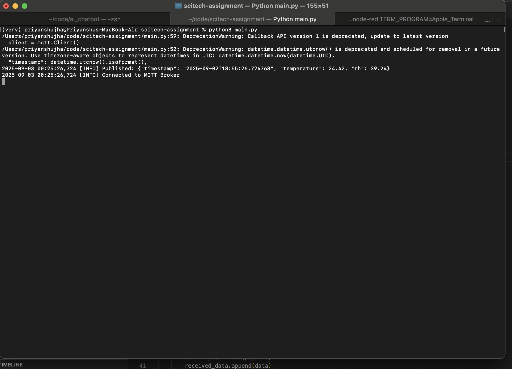
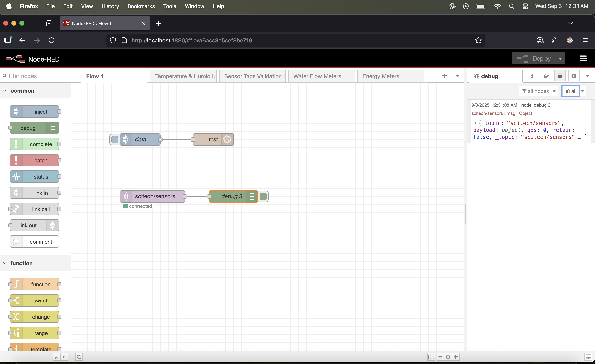

# IoT Data Pipeline

This repository contains code demonstrating typical IoT data-pipeline. It contains following contents - 
1. `main.py` Python script
2. `requirements.txt` list of python dependencies
3. `sensor_data.json` that contains data recieved by subscribing to the topic - `scitech/edge/temp_rh`
4. README to reproduce and test this setup
5. Report.docx containing report for this porject

# Introduction
This readme provides clear instructions on how to set up the environment and test the code on user machine.

## Installations and Environment Setup
You machine needs to have a mqtt broker in order to test this code, first step is to install one, for this we are installing [mosquitto](https://mosquitto.org/) mqtt broker.

* For Linux machines with Snap support 
```
sudo snap install mosquitto
```

* For Linux machines with apt
```
sudo apt-add-repository ppa:mosquitto-dev/mosquitto-ppa
```

```
sudo apt-get update
```

* Mac OS
```
brew install mosquitto
```

* Windows machine 

    Check downloads page - https://mosquitto.org/download/


## Python setup
Create a virtual environment for this setup to install necessary dependencies

* For Linux/Mac OS

    Create virtual environment
    ```
    python3 -m venv venv
    ```

    Activate virtual environment
    ```
    source venv/bin/activate
    ```

* For Windows 

    Create virtual environment
    ```
    python -m venv venv
    ```

    Activate virtual environment
    ```
    venv\Scripts\activate
    ```


* Installing packages

```
pip install requirements.txt
```

# Run this code
After successfull completion of the [Environment setup](#installations-and-environment-setup) and [Python setup](#python-setup) follow these steps - 

1. Open terminal type command - `mosquitto_sub -t "scitech/sensors" -v`

2. Open another terminal to run execute the script - `python3 main.py`

## Issues
In case your mqtt broker is not working for some reason change your mqtt broker to a public test broker.


In `main.py` - 

```
BROKER = "test.mosquitto.org"
PORT = 1883
```


# Screenshots

### Mqtt Broker


### Node-RED
